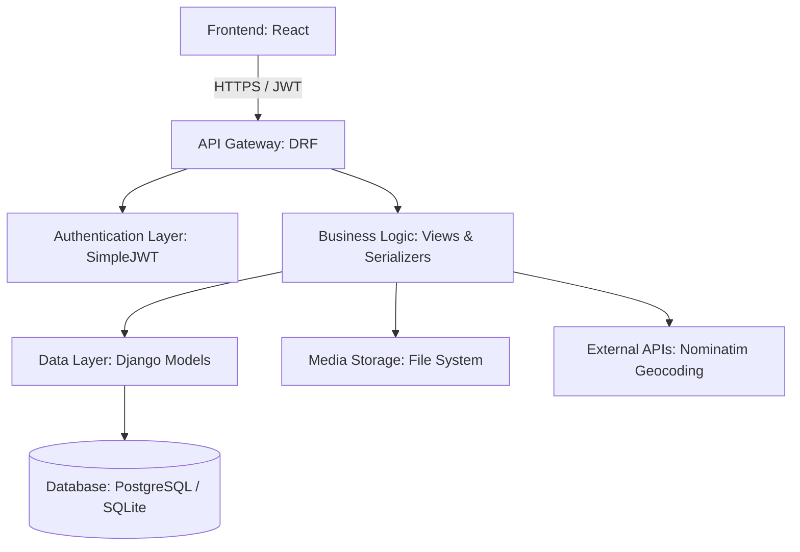

# CivicFix: Backend Architecture & Implementation Plan

This document provides a detailed breakdown of the CivicFix backend architecture, designed to be scalable, secure, and performant.

---

## 1. High-Level Architecture

The CivicFix backend is built using **Django** and **Django REST Framework (DRF)**. It follows a decoupled architecture, serving as a RESTful API for the React frontend.



---

## 2. Core Components

### A. Authentication & Security
*   **SimpleJWT**: Implements stateless authentication. Access tokens have a short lifespan, while refresh tokens allow users to stay logged in securely.
*   **Permissions**: 
    *   `IsAuthenticated`: Most endpoints require a valid token.
    *   `IsAdminUser`: Specific endpoints (like status updates or deletions) are restricted to administrators.
*   **CORS**: `django-cors-headers` is configured to allow requests specifically from the frontend domain.

### B. App Modules
The backend is divided into two primary Django apps:

1.  **`users` App**:
    *   **Custom User Model**: Inherits from `AbstractUser` to support email-based identification and custom roles (`is_admin`, `is_citizen`).
    *   **Serializers**: Handles secure registration and profile data conversion.

2.  **`issues` App**:
    *   **Issue Model**: Stores title, description, category, status, coordinates, address, and photo references.
    *   **Status Workflow**: Managed through a `CharField` with predefined choices (`pending`, `verified`, `in_progress`, `resolved`, `rejected`).
    *   **Post-Save Signals/Overrides**: Handles automatic image processing.

---

## 3. Data Flow & Processing Logic

### A. The "Smart" Serializer
The `IssueSerializer` is responsible for more than just data conversion; it handles **Location Intelligence**:
*   **Geocoding**: If a user provides an address string, the serializer calls the Nominatim API to resolve `lat` and `lng`.
*   **Reverse Geocoding**: If a user picks a point on a map, the serializer resolves the readable address.
*   **Validation**: Ensures that every issue has at least one location source before saving.

### B. Image Processing Pipeline (Pillow)
When an image is uploaded, the backend doesn't just store it raw. The `Issue.save()` method performs:
1.  **Aspect Ratio Correction**: Crops the image to a consistent 16:9 ratio.
2.  **Normalization**: Resizes images to a standard width (800px) to balance quality and load times.
3.  **Optimization**: Converts images to optimized JPEGs to minimize bandwidth usage.

---

## 4. Deployment Strategy (Render)

### A. Production Stack
*   **Web Server**: **Gunicorn** (Green Unicorn) is used as the WSGI HTTP Server. It is faster and more secure for production than Django's built-in `runserver`.
*   **Static Management**: `WhiteNoise` (or Django's `collectstatic`) is used to serve CSS/JS files if needed, though the frontend is deployed separately.

### B. Environment Configuration
Required environment variables for production:
*   `SECRET_KEY`: Django's unique secret.
*   `DEBUG`: Set to `False` in production.
*   `DATABASE_URL`: Connection string for the production PostgreSQL database.
*   `ALLOWED_HOSTS`: Domain names allowed to access the API.

---

## 5. Directory Structure (Backend)

```text
backend/
├── config/              # Project settings and root URL routing
├── users/               # User accounts and authentication
│   ├── models.py        # CustomUser definition
│   ├── serializers.py   # JWT & Signup logic
│   └── views.py         # Auth endpoints
├── issues/              # Core domain logic
│   ├── models.py        # Issue schema & image processing
│   ├── serializers.py   # Geocoding & validation
│   └── views.py         # Issue CRUD & Analytics
├── media/               # User-uploaded photos (issues_photos/)
├── manage.py            # CLI entry point
└── requirements.txt     # Linux-optimized dependencies
```
